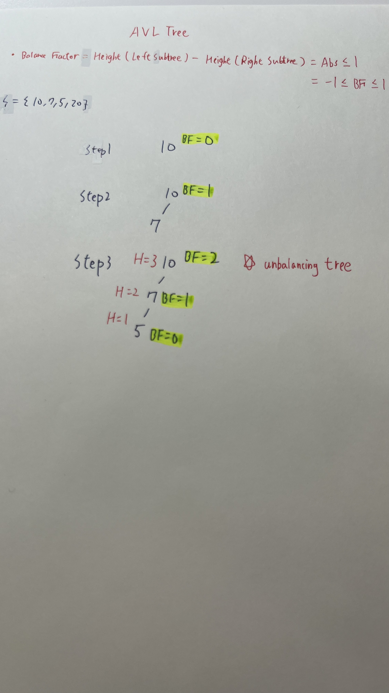
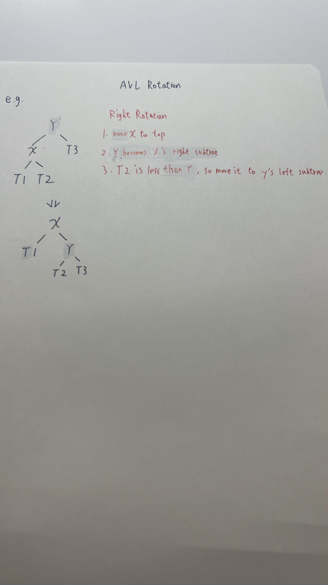
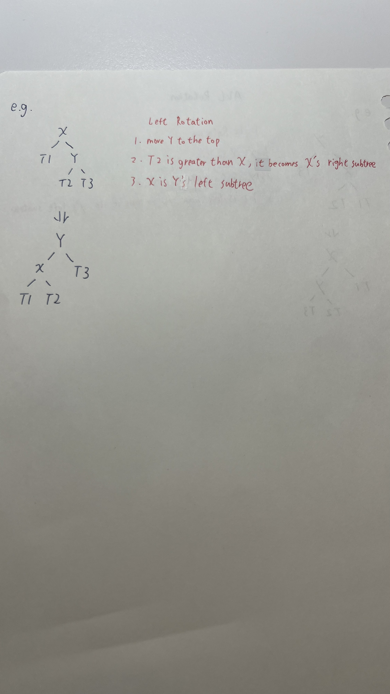
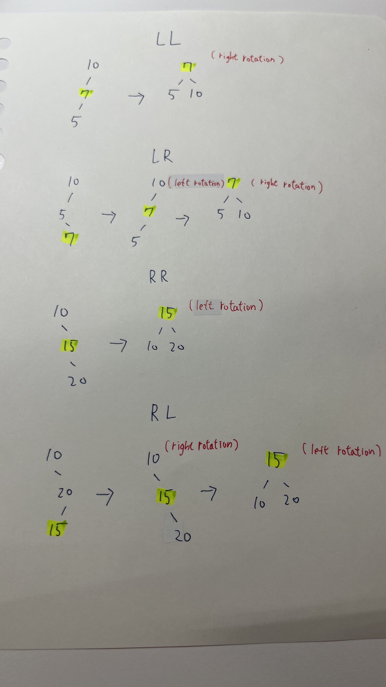

# Table of Contents

- [Table of Contents](#table-of-contents)
  - [Environment](#environment)
    - [Node.js Version](#nodejs-version)
    - [Command](#command)
  - [Data Structures](#data-structures)
    - [Stack](#stack)
    - [Queue](#queue)
      - [Regular Queue](#regular-queue)
        - [Time Complexity](#time-complexity)
        - [Implement](#implement)
      - [Circular Queue](#circular-queue)
        - [Applications of Circular Queue](#applications-of-circular-queue)
        - [Time Complexity](#time-complexity-1)
        - [Properties](#properties)
        - [Operations](#operations)
        - [Implement](#implement-1)
      - [Priority Queue](#priority-queue)
    - [Tree](#tree)
      - [Properties](#properties-1)
      - [Node](#node)
      - [Tree Traversal](#tree-traversal)
        - [In Order Traversal](#in-order-traversal)
        - [Pre Order Traversal](#pre-order-traversal)
        - [Post Order Traversal](#post-order-traversal)
        - [Level Order Traversal](#level-order-traversal)
      - [Binary Search Tree](#binary-search-tree)
        - [Loop Ver.](#loop-ver)
        - [Recursion Ver.](#recursion-ver)
      - [AVL Tree](#avl-tree)
        - [Time Complexity](#time-complexity-2)
        - [Height](#height)
        - [Balance Factor](#balance-factor)
        - [Right Rotation](#right-rotation)
        - [Left Rotation](#left-rotation)
        - [Left-Right Rotation](#left-right-rotation)
        - [Insert](#insert)
  - [Algorithms](#algorithms)
    - [Search](#search)
      - [Linear Search](#linear-search)
        - [Time Complexity](#time-complexity-3)
      - [Binary Search](#binary-search)
        - [Time Complexity](#time-complexity-4)
    - [Sort](#sort)
      - [Bubble Sort](#bubble-sort)
      - [Insertion Sort](#insertion-sort)
      - [Selection Sort](#selection-sort)
      - [Merge Sort](#merge-sort)
      - [Quick Sort](#quick-sort)

## Environment

### Node.js Version

`v18.16.0`

### Command

執行 typescript file

```
tsx <fileName>
```

## Data Structures

### Stack

### Queue

佇列(Queue)遵循著 Fist In First Out(FIFO) 原則。

#### Regular Queue

##### Time Complexity

- shift - $O(n)$
- pop - $O(1)$

一般來說，程式語言實作佇列(Queue)會設定固定大小，並且若元素取出後，會有閒置的空間。

舉例

```javascript
const arr = [1, 2, 3, 4];
```

取出頭部元素後

```javascript
const arr = [empty, 2, 3, 4];
```

而 JavaScript 實作的 **shift**，則是取出頭部元素後，將所有元素往前移動。也就是說，時間複雜度(time complexity) 會是 `O(n)`，當資料量過多時，會影響效能。

##### Implement

```typescript
import type QueueActions from "./QueueActions.ts";

class Queue<T> implements QueueActions<T> {
  private items: T[] = [];

  isEmpty(): boolean {
    return this.items.length === 0;
  }

  size(): number {
    return this.items.length;
  }

  peek(): T | undefined {
    if (this.items.length === 0) return undefined;
    return this.items[0];
  }

  enqueue(item: T): void {
    this.items.push(item);
  }

  dequeue(): T | undefined {
    if (this.isEmpty()) return undefined;
    return this.items.shift();
  }
}
```

#### Circular Queue

Circular Queue 常被稱作為 **Ring Buffer**，它的出現則是為了解決 [Regular Queue](#normal-queue) 移除元素的時間複雜度從 $O(n)$ 到 $O(1)$。

```
if REAR + 1 == 5 (overflow!), REAR = (REAR + 1)%5 = 0 (start of queue)
```

##### Applications of Circular Queue

- CPU scheduling
- Memory management
- Traffic Management

##### Time Complexity

- shift - $O(1)$
- pop - $O(1)`$

##### Properties

- pointers
  - rear - initial value `-1`
  - front - initial value `-1`
- size
- arr - container

##### Operations

- enqueue(value)
- dequeue
- isFull
- isEmpty

##### Implement

```typescript
class CircularQueue<T> {
  private arr: (T | null)[] = [];
  private size: number;
  private front: number;
  private rear: number;
  constructor(size: number) {
    if (size <= 0) throw new Error("Size must be a positive number.");

    this.front = -1;
    this.rear = -1;
    this.size = size;
    this.arr = new Array(size).fill(null);
  }

  //Adding element
  enqueue(value: T): T | string {
    if (this.isFull()) {
      return "The Queue is full.";
    }
    if (this.front == -1) {
      this.front = 0;
    }

    this.rear = (this.rear + 1) % this.size;
    this.arr[this.rear] = value;
    return value;
  }

  //Removing element
  dequeue(): T | null {
    if (this.isEmpty()) {
      return null;
    }

    const removedValue = this.arr[this.front];
    if (removedValue == undefined) {
      return null;
    }
    // set null
    this.arr[this.front] = null;

    if (this.front == this.rear) {
      this.front = -1;
      this.rear = -1;
    } else {
      this.front = (this.front + 1) % this.size;
    }
    return removedValue;
  }

  isFull(): boolean {
    return this.front === (this.rear + 1) % this.size;
  }

  isEmpty(): boolean {
    return this.front == -1;
  }
  display(): (T | null)[] {
    return [...this.arr];
  }
}

const circular_queue = new CircularQueue<number>(5);

circular_queue.enqueue(1);
console.log(circular_queue.display()); //[ 1, null, null, null, null ]

circular_queue.enqueue(2);
console.log(circular_queue.display()); //[ 1, 2, null, null, null ]

circular_queue.enqueue(3);
console.log(circular_queue.display()); //[ 1, 2, 3, null, null ]

circular_queue.enqueue(4);
console.log(circular_queue.display()); //[ 1, 2, 3, 4, null ]

circular_queue.enqueue(5);
console.log(circular_queue.display()); //[ 1, 2, 3, 4, 5 ]

circular_queue.dequeue();
console.log(circular_queue.display()); //[ null, 2, 3, 4, 5 ]

circular_queue.enqueue(6);
console.log(circular_queue.display()); //[ 6, 2, 3, 4, 5 ]
```

#### Priority Queue

### Tree

樹狀(Tree)為非線性資料結構(Non Liner)，由於線性資料結構如 **array**、**linked list** 通常操作的時間複雜度(Time Complexity)為 `O(n)`，當資料量一大，光查詢就是一個大問題。

解決方法就是將**linked list**的指標從一對一(one to one)轉成一對多(one to many)的關聯(associated)，並且依照所需的演算法分類好每個節點。

#### Properties

- Root - 頂點(Top of Tree)，沒有父節點
- Node - 包含資料，及指向子節點的指標
- Edge - 連接父節點與子節點
- Parent - 任何一個子節點的上層
- Child - 任何一個父節點指向的下一層節點
- Leaf - 沒有任何子節點的節點
- Sibling Node - 擁有相同父節點的水平節點，任一兄弟節點並不會相連
- Subtree - 某節點及其子、孫和更下層的所有節點
- Height - 由上往下數，從 Root 到 Leaf 的最大距離
- Depth - 由下往上數
- Level - Root 通常為 Level 0

#### Node

```typescript
// Node.ts
export default class Node<T> {
  data: T;
  left: Node<T> | null;
  right: Node<T> | null;

  constructor(data: T) {
    this.data = data;
    this.left = null;
    this.right = null;
  }
}
```

#### Tree Traversal

- DFS(Depth First Search)
  - in order traversal - `left → top → right`
  - pre order traversal - `top -> left -> right`
  - post order traversal - `left -> right -> top`
- BFS(Breadth First Search)
  - level order traversal

```typescript
// TreeActions.ts
export default interface TreeActions<T> {
  inOrder(): T[];
  preOrder(): T[];
  postOrder(): T[];
  levelOrder(): T[];
}
```

```javascript
import Node from "./Node.ts";
import type TreeActions from "./TreeActions.ts";
class BinaryTree<T> implements TreeActions<T> {
  public root: Node<T> | null; //直接存取、賦值，設為 public
  constructor() {
    this.root = null;
  }

  inOrder(): T[] {
    return [];
  }
  preOrder(): T[] {
    return [];
  }
  postOrder(): T[] {
    return [];
  }
  levelOrder(): T[] {
    return [];
  }
}

```

$S={ 5,3,12,9,1,30}$

依照普通二元樹(Regular Binary Tree)上到下、左至右規則，類似 Level Order 進行插入。

當然，要先插入左邊或右邊都可以！

```
     5


     5
    /
   3

     5
    / \
   3   12


     5
    / \
   3   12
  /
 9

     5
    / \
   3   12
  /\
 9  1

     5
    / \
   3   12
  /\     \
 9  1     30
```

```typescript
const binary_tree = new BinaryTree();

binary_tree.root = new Node(5);
binary_tree.root.left = new Node(3);
binary_tree.root.right = new Node(12);
binary_tree.root.left.left = new Node(9);
binary_tree.root.left.right = new Node(1);
binary_tree.root.right.right = new Node(30);
```

##### In Order Traversal

預期輸出 = [ 9, 3, 1, 5, 12, 30 ]

`left → top → right`

```
inOrder(root->left)
display(root->data)
inOrder(root->right)
```


可以看到將每個子樹(Subtree)一一拆解，就可以得知規律，也就是說每個節點都可以依照遞迴(Recursion)進行拆分。

```
_inOrder(5)
-> 有左子樹，遞迴 _inOrder(3)

_inOrder(3)
-> 有左子樹，遞迴 _inOrder(9)

_inOrder(9)
-> 沒有左子樹
-> arr.push(9)
-> 沒有右子樹，return;

回到 _inOrder(3)
-> arr.push(3)
-> 有右子樹，遞迴 _inOrder(1)

_inOrder(1)
-> 沒有左子樹
-> arr.push(1)
-> 沒有右子樹，return;

回到 _inOrder(5)
-> arr.push(5)
-> 有右子樹，遞迴 _inOrder(12)

_inOrder(12)
-> 沒有左子樹
-> arr.push(12)
-> 有右子樹，遞迴 _inOrder(30)

_inOrder(30)
-> 沒有左子樹
-> arr.push(30)
-> 沒有右子樹，return;
```

[ 9, 3, 1, 5, 12, 30 ]

```typescript
inOrder(): T[] {
    const arr: T[] = [];
    _inOrder(this.root); // recursion

    function _inOrder(node: Node<T> | null) {
      if (!node) return; //boundary

      if (node.left) _inOrder(node.left);
      arr.push(node.data);
      if (node.right) _inOrder(node.right);
    }
    return arr;
  }
```

##### Pre Order Traversal

預期輸出 = [ 5, 3, 9, 1, 12, 30 ]

```typescript
postOrder(): T[] {
  const output: T[] = [];
  _preOrder(this.root); //recursion

  function _preOrder(node: Node<T> | null) {
    if (!node) return; // boundary
    console.log(node.data);

    output.push(node.data);
    if (node.left) _preOrder(node.left);
    if (node.right) _preOrder(node.right);
  }
  console.log(output);
  return output;
}
```

##### Post Order Traversal

預期輸出 = [ 9, 1, 3, 30, 12, 5 ]

```typescript
postOrder(): T[] {
    const output: T[] = [];
    _postOrder(this.root); //recursion

    function _postOrder(node: Node<T> | null) {
      if (!node) return; // boundary
      console.log(node.data);

      if (node.left) _postOrder(node.left);
      if (node.right) _postOrder(node.right);
      output.push(node.data);
    }
    console.log(output);

    return output;
  }
```

##### Level Order Traversal

```typescript
levelOrder(): T[] {
    if (!this.root) return [];

    const queue: Node<T>[] = [this.root];
    const result: T[] = [];

    while (queue.length > 0) {
      const node = queue.shift();
      if (node) {
        result.push(node.data);

        if (node.left) {
          queue.push(node.left);
        }
        if (node.right) {
          queue.push(node.right);
        }
      }
    }

    return result;
  }
```

#### Binary Search Tree

- 左節點比父節點小
- 右節點比父節點大


##### Loop Ver.

```typescript
import BinaryTree from "./binary-tree";
import Node from "./Node";

class BinarySearchTree<T> extends BinaryTree<T> {
  constructor() {
    super();
  }

  insert(value: T) {
    const node = new Node<T>(value);
    if (this.root == null) {
      this.root = node;
      return;
    }

    let currentNode = this.root;
    while (true) {
      // boundary
      if (value == currentNode.data) break;

      // current node's value is less than value
      if (value > currentNode.data) {
        if (currentNode.right != null) {
          currentNode = currentNode.right;
        } else {
          currentNode.right = node;
          break;
        }
      } else if (value < currentNode.data) {
        // current node's value is greater than value
        if (currentNode.left != null) {
          currentNode = currentNode.left;
        } else {
          currentNode.left = node;
          break;
        }
      }
    }
  }
}

const binary_search_tree = new BinarySearchTree<number>();
binary_search_tree.insert(10);
binary_search_tree.insert(7);
binary_search_tree.insert(5);

console.log(binary_search_tree.levelOrder()); //[ 10, 7, 5 ]
```

##### Recursion Ver.

```typescript
  insertByRecursion(value: T) {
    if (this.root == null) {
      this.root = new Node(value);
      return;
    }

    _insert(this.root);

    function _insert(node: Node<T>) {
      //boundary
      if (node.data == value) return;
      // current node's value is less than value
      if (node.data < value) {
        if (node.right != null) {
          _insert(node.right);
        } else {
          node.right = new Node(value);
          return;
        }
      } else {
        // current node's value is greater than value
        if (node.left != null) {
          _insert(node.left);
        } else {
          node.left = new Node(value);
          return;
        }
      }
    }
  }
```

#### AVL Tree

AVL tree 是自調整二元搜尋樹(Self Balancing Binary Search Tree)，其名字來自 `Georgy Adelson-Velsky and Landis.`。

下圖為二元搜尋樹，可以看到在 Step3 的時候，樹其實是過度傾斜，也可是說變成鏈結串列(Linked List)。


而 AVL Tree 因為有了調整的因子(Balance Factor)，可以避免二元搜尋樹過度傾斜(Skewed Tree)的問題。

先建立一個實體

```typescript
// /tree/avl-tree.ts
import BST from "./binary-search-tree.ts";
import Node from "./Node.ts";

class AvlTree<T> extends BST<T> {
  constructor() {
    super();
  }

  insert(value: T) {}
}
```

##### Time Complexity

$O(log_2n)$



可以看到在 Step3 的 $Abs(BF)$ 超過 1，這時候就會進行平衡(Balancing)

##### Height

$Height = 1 + max(left,right)$

```typescript
getNodeHeight(node: Node<T> | null): number {
    if (!node) return 0;
    return (
      1 +
      Math.max(this.getNodeHeight(node.left), this.getNodeHeight(node.right))
    );
  }
```

##### Balance Factor

$Balance Factor = Height(left subtree) - Height(right subtree)$

$Value = Either -1, 0 or +1$

$Abs(Balance Factor) \le 1$

```typescript
getBalanceFactor(node: Node<T> | null) {
    if (!node) return 0;
    return this.getNodeHeight(node.left) - this.getNodeHeight(node.right);
  }
```

##### Right Rotation



```typescript
  rotateRight(node: Node<T>): Node<T> {
    if (!node.left) return node; // the node doesn't have a left subtree, therefore it can't do rotation

    // move to the top
    const newRoot = node.left;
    // store pre right subtree
    const preRightNode = newRoot.right;

    // rotating, pre top becomes to new top's right subtree
    newRoot.right = node;
    node.left = preRightNode;

    return newRoot;
  }
```

##### Left Rotation



```typescript
   rotateLeft(node: Node<T>): Node<T> {
    if (!node.right) return node; // The node doesn't have a right subtree, therefore, can't do rotation

    // move to the top
    const newRoot = node.right;
    // store pre right subtree
    const preLeftNode = newRoot.left;

    // rotating, pre top becomes to new top's right subtree
    newRoot.left = node;
    node.right = preLeftNode;

    return newRoot;
  }
```

##### Left-Right Rotation

首先，為什麼有了左旋跟右旋還要有 Left-Right Rotate？

先看向下圖的

```
LL (直線)
    z
   /
  y
 /
x

RR (直線)
z
 \
  y
   \
    x

```

可以發現這些可以只選轉一次即可平衡

但是像 LR 的這個 Case，當向右旋轉時，Y 的右邊會有 Z 跟 X。

```
LR (折彎)
    z
   /
  y
   \
    x

RL (折彎)
z
 \
  y
 /
x
```

##### Insert



```typescript
import BST from "./binary-search-tree.ts";
import Node from "./Node.ts";

class AvlTree<T> extends BST<T> {
  constructor() {
    super();
  }

  insert(value: T) {
    const _this = this;
    this.root = _insert(this.root, value);
    function _insert(node: Node<T> | null, value: T): Node<T> {
      if (!node) return new Node(value);

      if (value < node.data) {
        node.left = _insert(node.left, value);
      } else if (value > node.data) {
        node.right = _insert(node.right, value);
      }

      // perform AVL Tree

      const balanceFactor = _this.getBalanceFactor(node);

      //LL
      if (node.left && balanceFactor > 1 && value < node.left.data) {
        return _this.rotateRight(node);
      }
      //LR
      if (node.left && balanceFactor > 1 && value > node.left.data) {
        node.left = _this.rotateLeft(node.left);
        return _this.rotateRight(node);
      }

      //RR
      if (node.right && balanceFactor < 1 && value > node.right.data) {
        return _this.rotateLeft(node);
      }
      //RL
      if (node.right && balanceFactor < 1 && value < node.right.data) {
        node.right = _this.rotateRight(node.right);
        return _this.rotateLeft(node);
      }

      return node;
    }
  }
}
const avl_tree = new AvlTree<number>();
const num_list = [10, 7, 5];
num_list.forEach((num) => avl_tree.insert(num));
console.log(avl_tree.levelOrder()); //[7,5,10]
```

## Algorithms

### Search

#### Linear Search

在資料未經過排序時(unordered)，線性搜尋是一個非常簡單、資料量少最常用的搜尋方式。

##### Time Complexity

$O(n)$

```typescript
const arr = [3, 6, 8, 1, 0];

function linearSearch(arr: number[], target: number) {
  for (let i = 0; i < arr.length - 1; i++) {
    if (arr[i] == target) return `The target's index is ${i}`;
  }
  return `${target} doesn't exist the arr`;
}

console.log(linearSearch(arr, 6)); //The target's index is 6
```

#### Binary Search

##### Time Complexity

$O(log_2n)$

```typescript
const arr = [1, 3, 5, 7, 9, 11, 13];

function binarySearch(arr: number[], target: number) {
  let left = 0;
  let right = arr.length - 1;

  while (left <= right) {
    let middle = Math.floor((left + right) / 2);
    //boundary
    if (!arr[middle]) return `The target ${target} is out of the array.`;

    if (arr[middle] == target) {
      return middle;
    } else if (arr[middle] > target) {
      right = middle - 1;
    } else {
      left = middle + 1;
    }
  }
}

console.log(binarySearch(arr, 100)); // The target 100 is out of the array
console.log(binarySearch(arr, 13)); // 6
```

### Sort

#### Bubble Sort

$O(n^2)$

```typescript
const arr: number[] = [1, 3, 0, 6, 2];

function bubbleSort(arr: number[]): number[] {
  for (let i = 0; i < arr.length - 1; i++) {
    for (let j = 0; j < arr.length - 1; j++) {
      if (arr[j] > arr[j + 1]) {
        const temp = arr[j];
        arr[j] = arr[j + 1];
        arr[j + 1] = temp;
      }
    }
  }
  return arr;
}

console.log(bubbleSort(arr)); // [0, 1, 2, 3, 6]
```

#### Insertion Sort

$O(n^2)$

```typescript
const arr: number[] = [1, 3, 0, 6, 2, -1];

function insertionSort(arr: number[]): number[] {
  for (let i = 1; i < arr.length; i++) {
    let index = null;
    for (let j = i - 1; j > 0; j--) {
      if (arr[j] > arr[i]) {
        index = j;
      }
    }

    if (index != null) {
      // swap
      const temp = arr[i];
      arr[i] = arr[index];
      arr[index] = temp;
    }
  }
  return arr;
}

console.log(insertionSort(arr));
```

#### Selection Sort

$O(n^2)$

```typescript
const arr: number[] = [1, 3, 0, 6, 2, -1];
function selectionSort(arr: number[]): number[] {
  for (let i = 0; i < arr.length; i++) {
    let index = i; //default
    for (let j = i + 1; j < arr.length; j++) {
      if (arr[j] < arr[index]) {
        index = j;
      }
    }

    // swap
    const temp = arr[i];
    arr[i] = arr[index];
    arr[index] = temp;
  }
  return arr;
}

console.log(selectionSort(arr)); //[ -1, 0, 1, 2, 3, 6 ]
```

#### Merge Sort

- $Dividing(O(log_2n))$
- $Merging(O(n))$
- $Dividing * Merging = O(nlogn)$

  每次都必須切割，當陣列長度只有 1 時，就代表已排序完畢。

```typescript
function mergeSort(arr: number[]): number[] {
  if (arr.length == 1) return arr;

  const middle = Math.floor(arr.length / 2);
  const left = arr.slice(0, middle);
  const right = arr.slice(middle, arr.length);
  return merge(mergeSort(left), mergeSort(right));
}
```

每次必須比較左右的陣列，並且收尾的部分，有可能右邊、或左邊超過一個元素，所以利用 while loop。

```typescript
function merge(left: number[] = [], right: number[] = []): number[] {
  const arr: number[] = [];
  let l_index = 0;
  let r_index = 0;

  while (l_index < left.length && r_index < right.length) {
    if (left[l_index] < right[r_index]) {
      arr.push(left[l_index]);
      l_index++;
    } else {
      arr.push(right[r_index]);
      r_index++;
    }
  }

  while (l_index < left.length) {
    arr.push(left[l_index]);
    l_index++;
  }

  while (r_index < right.length) {
    arr.push(right[r_index]);
    r_index++;
  }
  console.log(arr);
  return arr;
}
```

#### Quick Sort
