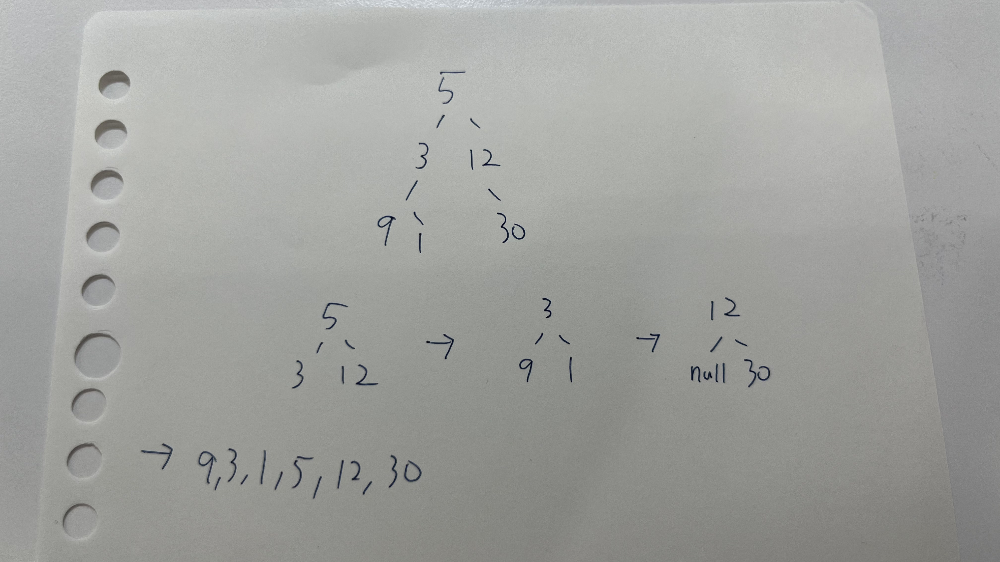

# Table of Contents

- [Table of Contents](#table-of-contents)
  - [Environment](#environment)
    - [Node.js Version](#nodejs-version)
    - [Command](#command)
  - [Data Structures](#data-structures)
    - [Stack](#stack)
    - [Queue](#queue)
      - [Regular Queue](#regular-queue)
        - [Time Complexity](#time-complexity)
        - [Implement](#implement)
      - [Circular Queue](#circular-queue)
        - [Applications of Circular Queue](#applications-of-circular-queue)
        - [Time Complexity](#time-complexity-1)
        - [Properties](#properties)
        - [Operations](#operations)
        - [Implement](#implement-1)
      - [Priority Queue](#priority-queue)
    - [Tree](#tree)
      - [Properties](#properties-1)
      - [Node](#node)
      - [Tree Traversal](#tree-traversal)
        - [In Order Traversal](#in-order-traversal)
        - [Pre Order Traversal](#pre-order-traversal)
        - [Post Order Traversal](#post-order-traversal)
        - [Level Order Traversal](#level-order-traversal)
  - [Algorithms](#algorithms)

## Environment

### Node.js Version

`v18.16.0`

### Command

執行 typescript file

```
tsx <fileName>
```

## Data Structures

### Stack

### Queue

佇列(Queue)遵循著 Fist In First Out(FIFO) 原則。

#### Regular Queue

##### Time Complexity

- shift - $O(n)$
- pop - $O(1)$

一般來說，程式語言實作佇列(Queue)會設定固定大小，並且若元素取出後，會有閒置的空間。

舉例

```javascript
const arr = [1, 2, 3, 4];
```

取出頭部元素後

```javascript
const arr = [empty, 2, 3, 4];
```

而 JavaScript 實作的 **shift**，則是取出頭部元素後，將所有元素往前移動。也就是說，時間複雜度(time complexity) 會是 `O(n)`，當資料量過多時，會影響效能。

##### Implement

```typescript
import type QueueActions from "./QueueActions.ts";

class Queue<T> implements QueueActions<T> {
  private items: T[] = [];

  isEmpty(): boolean {
    return this.items.length === 0;
  }

  size(): number {
    return this.items.length;
  }

  peek(): T | undefined {
    if (this.items.length === 0) return undefined;
    return this.items[0];
  }

  enqueue(item: T): void {
    this.items.push(item);
  }

  dequeue(): T | undefined {
    if (this.isEmpty()) return undefined;
    return this.items.shift();
  }
}
```

#### Circular Queue

Circular Queue 常被稱作為 **Ring Buffer**，它的出現則是為了解決 [Regular Queue](#normal-queue) 移除元素的時間複雜度從 $O(n)$ 到 $O(1)$。

```
if REAR + 1 == 5 (overflow!), REAR = (REAR + 1)%5 = 0 (start of queue)
```

##### Applications of Circular Queue

- CPU scheduling
- Memory management
- Traffic Management

##### Time Complexity

- shift - $O(1)$
- pop - $O(1)`$

##### Properties

- pointers
  - rear - initial value `-1`
  - front - initial value `-1`
- size
- arr - container

##### Operations

- enqueue(value)
- dequeue
- isFull
- isEmpty

##### Implement

```typescript
class CircularQueue<T> {
  private arr: (T | null)[] = [];
  private size: number;
  private front: number;
  private rear: number;
  constructor(size: number) {
    if (size <= 0) throw new Error("Size must be a positive number.");

    this.front = -1;
    this.rear = -1;
    this.size = size;
    this.arr = new Array(size).fill(null);
  }

  //Adding element
  enqueue(value: T): T | string {
    if (this.isFull()) {
      return "The Queue is full.";
    }
    if (this.front == -1) {
      this.front = 0;
    }

    this.rear = (this.rear + 1) % this.size;
    this.arr[this.rear] = value;
    return value;
  }

  //Removing element
  dequeue(): T | null {
    if (this.isEmpty()) {
      return null;
    }

    const removedValue = this.arr[this.front];
    if (removedValue == undefined) {
      return null;
    }
    // set null
    this.arr[this.front] = null;

    if (this.front == this.rear) {
      this.front = -1;
      this.rear = -1;
    } else {
      this.front = (this.front + 1) % this.size;
    }
    return removedValue;
  }

  isFull(): boolean {
    return this.front === (this.rear + 1) % this.size;
  }

  isEmpty(): boolean {
    return this.front == -1;
  }
  display(): (T | null)[] {
    return [...this.arr];
  }
}

const circular_queue = new CircularQueue<number>(5);

circular_queue.enqueue(1);
console.log(circular_queue.display()); //[ 1, null, null, null, null ]

circular_queue.enqueue(2);
console.log(circular_queue.display()); //[ 1, 2, null, null, null ]

circular_queue.enqueue(3);
console.log(circular_queue.display()); //[ 1, 2, 3, null, null ]

circular_queue.enqueue(4);
console.log(circular_queue.display()); //[ 1, 2, 3, 4, null ]

circular_queue.enqueue(5);
console.log(circular_queue.display()); //[ 1, 2, 3, 4, 5 ]

circular_queue.dequeue();
console.log(circular_queue.display()); //[ null, 2, 3, 4, 5 ]

circular_queue.enqueue(6);
console.log(circular_queue.display()); //[ 6, 2, 3, 4, 5 ]
```

#### Priority Queue

### Tree

樹狀(Tree)為非線性資料結構(Non Liner)，由於線性資料結構如 **array**、**linked list** 通常操作的時間複雜度(Time Complexity)為 `O(n)`，當資料量一大，光查詢就是一個大問題。

解決方法就是將**linked list**的指標從一對一(one to one)轉成一對多(one to many)的關聯(associated)，並且依照所需的演算法分類好每個節點。

#### Properties

- Root - 頂點(Top of Tree)，沒有父節點
- Node - 包含資料，及指向子節點的指標
- Edge - 連接父節點與子節點
- Parent - 任何一個子節點的上層
- Child - 任何一個父節點指向的下一層節點
- Leaf - 沒有任何子節點的節點
- Sibling Node - 擁有相同父節點的水平節點，任一兄弟節點並不會相連
- Subtree - 某節點及其子、孫和更下層的所有節點
- Height - 由上往下數，從 Root 到 Leaf 的最大距離
- Depth - 由下往上數
- Level - Root 通常為 Level 0

#### Node

```typescript
// Node.ts
export default class Node<T> {
  data: T;
  left: Node<T> | null;
  right: Node<T> | null;

  constructor(data: T) {
    this.data = data;
    this.left = null;
    this.right = null;
  }
}
```

#### Tree Traversal

- DFS(Depth First Search)
  - in order traversal - `left → top → right`
  - pre order traversal - `top -> left -> right`
  - post order traversal - `left -> right -> top`
- BFS(Breadth First Search)
  - level order traversal

```typescript
// TreeActions.ts
export default interface TreeActions<T> {
  inOrder(): T[];
  preOrder(): T[];
  postOrder(): T[];
  levelOrder(): T[];
}
```

```javascript
import Node from "./Node.ts";
import type TreeActions from "./TreeActions.ts";
class BinaryTree<T> implements TreeActions<T> {
  public root: Node<T> | null; //直接存取、賦值，設為 public
  constructor() {
    this.root = null;
  }

  inOrder(): T[] {
    return [];
  }
  preOrder(): T[] {
    return [];
  }
  postOrder(): T[] {
    return [];
  }
  levelOrder(): T[] {
    return [];
  }
}

```

$S={ 5,3,12,9,1,30}$

依照普通二元樹(Regular Binary Tree)上到下、左至右規則，類似 Level Order 進行插入。

當然，要先插入左邊或右邊都可以！

```
     5


     5
    /
   3

     5
    / \
   3   12


     5
    / \
   3   12
  /
 9

     5
    / \
   3   12
  /\
 9  1

     5
    / \
   3   12
  /\     \
 9  1     30
```

```typescript
const binary_tree = new BinaryTree();

binary_tree.root = new Node(5);
binary_tree.root.left = new Node(3);
binary_tree.root.right = new Node(12);
binary_tree.root.left.left = new Node(9);
binary_tree.root.left.right = new Node(1);
binary_tree.root.right.right = new Node(30);
```

##### In Order Traversal

預期輸出 = [ 9, 3, 1, 5, 12, 30 ]

`left → top → right`

```
inOrder(root->left)
display(root->data)
inOrder(root->right)
```



可以看到將每個子樹(Subtree)一一拆解，就可以得知規律，也就是說每個節點都可以依照遞迴(Recursion)進行拆分。

```
_inOrder(5)
-> 有左子樹，遞迴 _inOrder(3)

_inOrder(3)
-> 有左子樹，遞迴 _inOrder(9)

_inOrder(9)
-> 沒有左子樹
-> arr.push(9)
-> 沒有右子樹，return;

回到 _inOrder(3)
-> arr.push(3)
-> 有右子樹，遞迴 _inOrder(1)

_inOrder(1)
-> 沒有左子樹
-> arr.push(1)
-> 沒有右子樹，return;

回到 _inOrder(5)
-> arr.push(5)
-> 有右子樹，遞迴 _inOrder(12)

_inOrder(12)
-> 沒有左子樹
-> arr.push(12)
-> 有右子樹，遞迴 _inOrder(30)

_inOrder(30)
-> 沒有左子樹
-> arr.push(30)
-> 沒有右子樹，return;
```

[ 9, 3, 1, 5, 12, 30 ]

```typescript
inOrder(): T[] {
    const arr: T[] = [];
    _inOrder(this.root); // recursion

    function _inOrder(node: Node<T> | null) {
      if (!node) return; //boundary

      if (node.left) _inOrder(node.left);
      arr.push(node.data);
      if (node.right) _inOrder(node.right);
    }
    return arr;
  }
```

##### Pre Order Traversal

預期輸出 = [ 5, 3, 9, 1, 12, 30 ]

```typescript
postOrder(): T[] {
  const output: T[] = [];
  _preOrder(this.root); //recursion

  function _preOrder(node: Node<T> | null) {
    if (!node) return; // boundary
    console.log(node.data);

    output.push(node.data);
    if (node.left) _preOrder(node.left);
    if (node.right) _preOrder(node.right);
  }
  console.log(output);
  return output;
}
```

##### Post Order Traversal

預期輸出 = [ 9, 1, 3, 30, 12, 5 ]

```typescript
postOrder(): T[] {
    const output: T[] = [];
    _postOrder(this.root); //recursion

    function _postOrder(node: Node<T> | null) {
      if (!node) return; // boundary
      console.log(node.data);

      if (node.left) _postOrder(node.left);
      if (node.right) _postOrder(node.right);
      output.push(node.data);
    }
    console.log(output);

    return output;
  }
```

##### Level Order Traversal

---

## Algorithms
